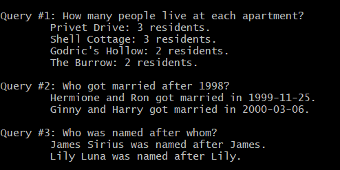

# Diagon Alley

A Neo4j graph database application that models relationships between people, including family links, marriages and residences.

## Project Structure

```
diagon-alley/
├── main.py           # Main entry point for database setup and queries
├── api.py            # Flask REST API endpoints
├── schema.py         # Neo4j data models (Person, Apartment, relationships)
├── data.py           # Data upload and relationship creation functions
├── queries.py        # Sample Cypher queries
├── Dockerfile        # Docker configuration
```

## Getting Started

### Prerequisites

- Python 3.8+
- Neo4j database instance
- Docker (optional)

### Installation

1. Clone the repository
   ```bash
   git clone https://github.com/JuditHalperin/diagon-alley.git
   cd diagon-alley
   ```

2. Install dependencies
   ```bash
   pip install -r requirements.txt
   ```

3. Configure database connection
   
   Update the `PASSWORD` and `IP_ADDRESS` in both `main.py` and `api.py`:
   ```python
   PASSWORD = 'your_neo4j_password'
   IP_ADDRESS = 'your_neo4j_ip_address'
   ```


### Running the Application

```bash
# Load data and run sample queries
python main.py

# Start the Flask API server
python api.py
```

## Example of the Wizarding World

